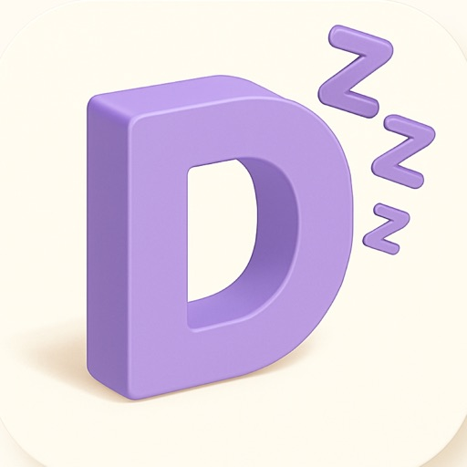
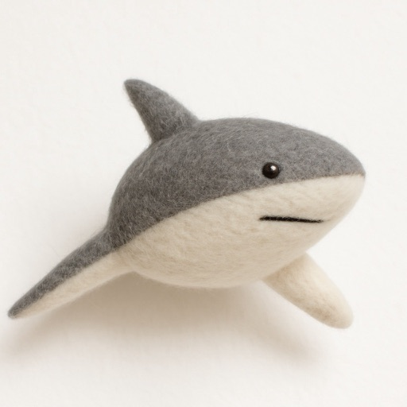

# Jiangdi's Independent Apps

[中文版本](README.zh-CN.md)

Hi, I am an independent developer building practical apps across AI, productivity, personal records, creative tools, and small utilities. Below are some of my published products. I am continuing to build new products and iterate on existing ones.

## Products

| Icon | Product | Platforms | Released | App Store |
| --- | --- | --- | --- | --- |
|  | Ranni - Agent on your phone | iOS | 2026-05-19 | [Open](https://apps.apple.com/app/id6766916724) |
|  | Peakpoo | iOS | 2026-04-27 | [Open](https://apps.apple.com/app/id6763457414) |
|  | ReadCut - Edit Audio Like Text | macOS | 2026-04-07 | [Open](https://apps.apple.com/app/id6761426535) |
|  | NumbBrain: Screen Time Control | iOS | 2025-10-19 | [Open](https://apps.apple.com/app/id6751564003) |
|  | Timeland - Save Your Journey | iOS | 2025-10-06 | [Open](https://apps.apple.com/app/id6752765624) |
|  | Lorqa - Local AI Translator | macOS | 2025-08-14 | [Open](https://apps.apple.com/app/id6749881415) |
|  | Langry - AI Language Writing | iOS, macOS | 2025-02-17 | [Open](https://apps.apple.com/app/id6741383609) |
|  | HomTodo - Plan smart, live well | iOS | 2024-12-18 | [Open](https://apps.apple.com/app/id6739244386) |
|  | JoyFish - Growth Tracker | iOS | 2024-10-15 | [Open](https://apps.apple.com/app/id6736854347) |
|  | Dorma - Record Your Sleep | iOS | 2024-09-04 | [Open](https://apps.apple.com/app/id6670309278) |
|  | WaveCam - Digital Portrait | iOS | 2024-03-05 | [Open](https://apps.apple.com/app/id6478093469) |
| - | TalkAgent - Polyglot Voice Chat | iOS | 2024-01-03 | [Open](https://apps.apple.com/app/id6472412023) |
| - | PicRefine - SuperRes & Color | iOS | 2023-12-14 | [Open](https://apps.apple.com/app/id6474378874) |
|  | PocketLM - Pocket AI Client | iOS, macOS | 2023-03-14 | [Open](https://apps.apple.com/app/id6446176892) |
|  | JoyFusion - AI Generation | iOS, macOS | 2022-12-29 | [Open](https://apps.apple.com/app/id1661652021) |
| - | Package Boy | iOS | 2022-09-30 | [Open](https://apps.apple.com/app/id6443626474) |
| - | Fill Cube - Block Puzzle | iOS | 2022-08-17 | [Open](https://apps.apple.com/app/id1640257086) |
| - | Sudoku Infinite Challenge | iOS | 2022-07-27 | [Open](https://apps.apple.com/app/id1636728883) |
|  | Recharge Me - save your battery | iOS | 2022-06-09 | [Open](https://apps.apple.com/app/id1623561852) |
| - | Easy Links - URL link analytics | iOS | 2022-03-18 | [Open](https://apps.apple.com/app/id1610134206) |
|  | Planthunter - Growth Tracker | iOS | 2022-03-09 | [Open](https://apps.apple.com/app/id1612833329) |
|  | RssCube - Fast News Reader | iOS | 2022-01-03 | [Open](https://apps.apple.com/app/id1602812291) |
|  | Shark Shot-N in 1 Grab Picture | iOS | 2021-10-24 | [Open](https://apps.apple.com/app/id1590075896) |
|  | Castflow - A Fast Podcast App | iOS, macOS | 2021-08-21 | [Open](https://apps.apple.com/app/id1572179241) |
