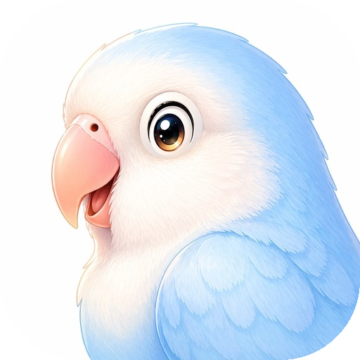
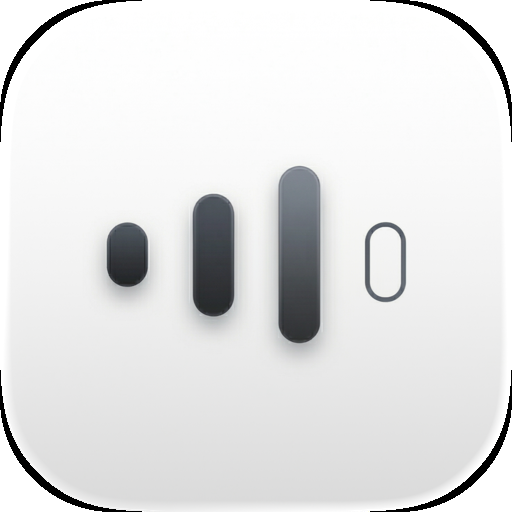
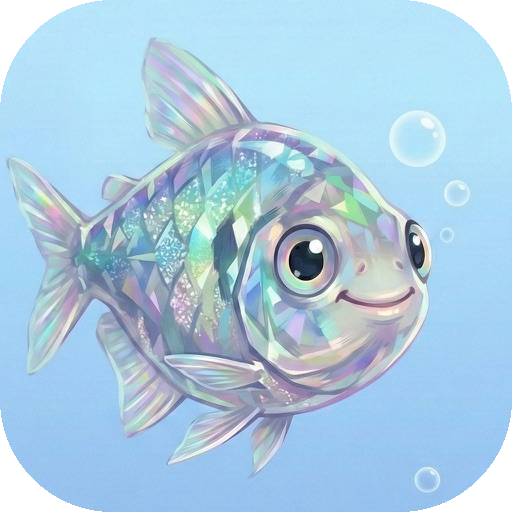
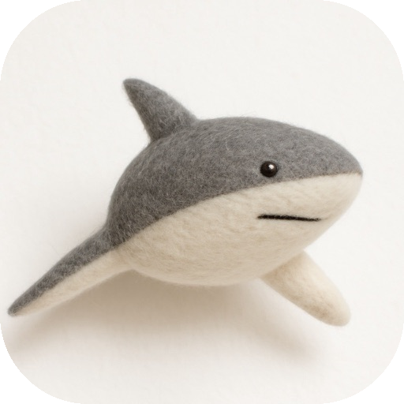

# Jiangdi 的独立开发产品

[English](README.md)

你好，我是一名正在尝试独立开发的开发者，持续构建 AI、效率工具、个人记录、创作工具和小型实用工具。下面是我已经发布的一些产品，欢迎体验。我也会继续构建新的产品，并持续迭代已有应用。

## 产品列表

| 图标 | 产品 | 平台 | 发布日期 | App Store |
| --- | --- | --- | --- | --- |
|  | Ranni - 你的掌上AI 智能体 | iOS | 2026-05-19 | [打开](https://apps.apple.com/app/id6766916724) |
|  | Peakpoo | iOS | 2026-04-27 | [打开](https://apps.apple.com/app/id6763457414) |
|  | ReadCut - Edit Audio Like Text | macOS | 2026-04-07 | [打开](https://apps.apple.com/app/id6761426535) |
|  | NumbBrain - 控制屏幕时间 | iOS | 2025-10-19 | [打开](https://apps.apple.com/app/id6751564003) |
|  | 旅行日志 - 个人旅行记录 | iOS | 2025-10-06 | [打开](https://apps.apple.com/app/id6752765624) |
|  | Lorqa - 本地AI翻译 | macOS | 2025-08-14 | [打开](https://apps.apple.com/app/id6749881415) |
|  | Langry - 用外语写日记 | iOS, macOS | 2025-02-17 | [打开](https://apps.apple.com/app/id6741383609) |
|  | HomTodo - 轻松规划家中大小事务 | iOS | 2024-12-18 | [打开](https://apps.apple.com/app/id6739244386) |
|  | 鱼之乐 - 小鱼成长记录与追踪 | iOS | 2024-10-15 | [打开](https://apps.apple.com/app/id6736854347) |
|  | Dorma - 睡眠记录和归因 | iOS | 2024-09-04 | [打开](https://apps.apple.com/app/id6670309278) |
|  | 映画相机- 人物肖像生成 | iOS | 2024-03-05 | [打开](https://apps.apple.com/app/id6478093469) |
| - | TalkAgent - 多语言语音对话 | iOS | 2024-01-03 | [打开](https://apps.apple.com/app/id6472412023) |
| - | PicRefine - 图片着色和超分辨率 | iOS | 2023-12-14 | [打开](https://apps.apple.com/app/id6474378874) |
|  | PocketLM - 本地AI模型客户端 | iOS, macOS | 2023-03-14 | [打开](https://apps.apple.com/app/id6446176892) |
|  | JoyFusion - AI绘画生成创意 | iOS, macOS | 2022-12-29 | [打开](https://apps.apple.com/app/id1661652021) |
| - | 包裹小子 | iOS | 2022-09-30 | [打开](https://apps.apple.com/app/id6443626474) |
| - | Fill Cube - Block Puzzle | iOS | 2022-08-17 | [打开](https://apps.apple.com/app/id1640257086) |
| - | Sudoku Infinite Challenge | iOS | 2022-07-27 | [打开](https://apps.apple.com/app/id1636728883) |
|  | 给它电 | iOS | 2022-06-09 | [打开](https://apps.apple.com/app/id1623561852) |
| - | Easy Links - URL链接分享数据追踪 | iOS | 2022-03-18 | [打开](https://apps.apple.com/app/id1610134206) |
|  | 植物猎人 - 植物成长记录与追踪 | iOS | 2022-03-09 | [打开](https://apps.apple.com/app/id1612833329) |
|  | RssCube - RSS阅读器 | iOS | 2022-01-03 | [打开](https://apps.apple.com/app/id1602812291) |
|  | 鲨鱼取图-选出好照片 | iOS | 2021-10-24 | [打开](https://apps.apple.com/app/id1590075896) |
|  | Castflow - 泛用型播客客户端 | iOS, macOS | 2021-08-21 | [打开](https://apps.apple.com/app/id1572179241) |
